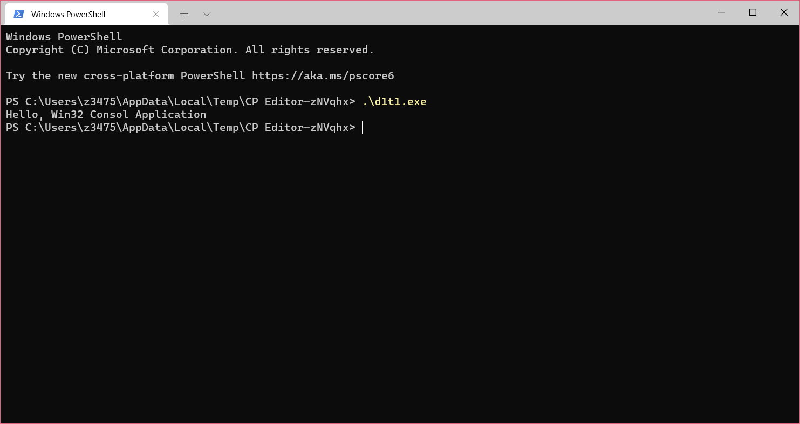
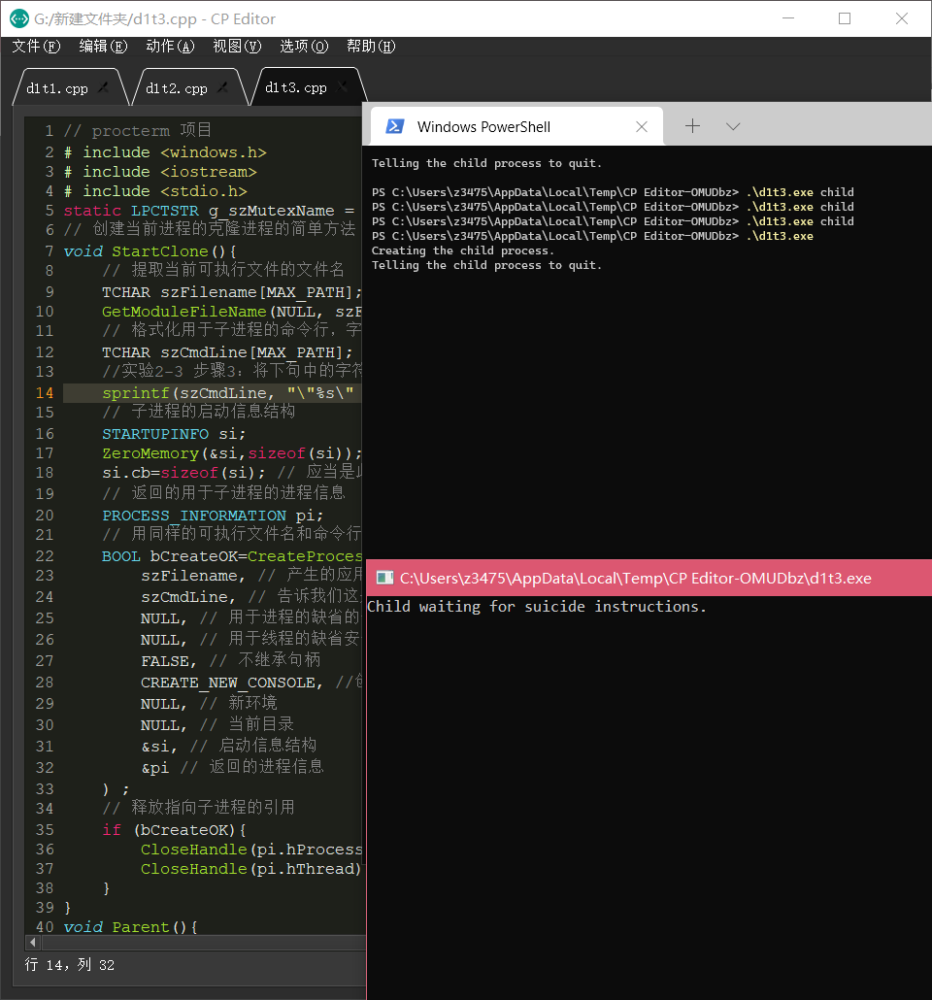

# 实验1-Windows进程管理

## 实验目的

- 学会使用VC编写基本的Win32 Console Application
- 通过创建进程、观察正在运行的进程和终止进程的程序设计和调试操作，进一步熟悉操作系统的进程概念，理解Windows进程的“一生”
- 通过阅读和分析试验程序，学习创建进程、观察进程、终止进程以及父子进程同步的基本程序设计方法

## 实验内容

### 子实验1-编写基本的Win32 Console Application

```cpp
#include <iostream>
int main()
{
	std::cout << "Hello, Win32 Consol Application" << std::endl;
}
```

### 子实验2-创建进程
  
```cpp
#include <windows.h>
#include <iostream>
#include <stdio.h>
// 创建传递过来的进程的克隆过程并赋于其ID 值
void StartClone(int nCloneID){
	// 提取用于当前可执行文件的文件名
	TCHAR szFilename[MAX_PATH];
	GetModuleFileName(NULL, szFilename, MAX_PATH);
	// 格式化用于子进程的命令行并通知其EXE 文件名和克隆ID
	TCHAR szCmdLine[MAX_PATH];
	sprintf(szCmdLine,"\"%s\" %d",szFilename,nCloneID);
	// 用于子进程的STARTUPINFO 结构
	STARTUPINFO si;
	ZeroMemory(&si,sizeof(si));
	si.cb=sizeof(si); // 必须是本结构的大小
	// 返回的用于子进程的进程信息
	PROCESS_INFORMATION pi;
	// 利用同样的可执行文件和命令行创建进程，并赋于其子进程的性质
	BOOL bCreateOK=::CreateProcess(
		szFilename, // 产生这个EXE 的应用程序的名称
		szCmdLine, // 告诉其行为像一个子进程的标志
		NULL, // 缺省的进程安全性
		NULL, // 缺省的线程安全性
		FALSE, // 不继承句柄
		CREATE_NEW_CONSOLE, // 使用新的控制台
		NULL, // 新的环境
		NULL, // 当前目录
		&si, // 启动信息
		&pi  // 返回的进程信息
	);
	// 对子进程释放引用
	if (bCreateOK){
		CloseHandle(pi.hProcess);
		CloseHandle(pi.hThread);
	}
}
int main(int argc,char* argv[]){
	// 确定派生出几个进程，及派生进程在进程列表中的位置
	int nClone=0;
	//修改语句：int nClone;
	//第一次修改：nClone=0;
	if (argc > 1){
		// 从第二个参数中提取克隆ID
		sscanf(argv[1] , "%d" , &nClone) ;
	}
	//第二次修改：nClone=0;
	// 显示进程位置
	std::cout << "Process ID:" << GetCurrentProcessId()
			<< ", Clone ID:" << nClone
			<< std :: endl;
	// 检查是否有创建子进程的需要
	const int c_nCloneMax=5;
	if (nClone < c_nCloneMax){
		// 发送新进程的命令行和克隆号
		StartClone(++nClone) ;
	} // 等待响应键盘输入结束进程
	getchar();
	return 0;
}
```

### 子实验3-父子进程的简单通信和终止进程

```cpp
// procterm 项目
# include <windows.h>
# include <iostream>
# include <stdio.h>
static LPCTSTR g_szMutexName = "w2kdg.ProcTerm.mutex.Suicide" ;
// 创建当前进程的克隆进程的简单方法
void StartClone(){
	// 提取当前可执行文件的文件名
	TCHAR szFilename[MAX_PATH];
	GetModuleFileName(NULL, szFilename, MAX_PATH);
	// 格式化用于子进程的命令行，字符串“child”将作为形参传递给子进程的main 函数
	TCHAR szCmdLine[MAX_PATH];
	//实验2-3 步骤3：将下句中的字符串child 改为别的字符串，重新编译执行，执行前请先保存已经完成的工作
	sprintf(szCmdLine, "\"%s\" child" , szFilename);
	// 子进程的启动信息结构
	STARTUPINFO si;
	ZeroMemory(&si,sizeof(si));
	si.cb=sizeof(si); // 应当是此结构的大小
	// 返回的用于子进程的进程信息
	PROCESS_INFORMATION pi;
	// 用同样的可执行文件名和命令行创建进程，并指明它是一个子进程
	BOOL bCreateOK=CreateProcess(
		szFilename, // 产生的应用程序的名称(本EXE 文件)
		szCmdLine, // 告诉我们这是一个子进程的标志
		NULL, // 用于进程的缺省的安全性
		NULL, // 用于线程的缺省安全性
		FALSE, // 不继承句柄
		CREATE_NEW_CONSOLE, //创建新窗口
		NULL, // 新环境
		NULL, // 当前目录
		&si, // 启动信息结构
		&pi // 返回的进程信息
	) ;
	// 释放指向子进程的引用
	if (bCreateOK){
		CloseHandle(pi.hProcess);
		CloseHandle(pi.hThread);
	}
}
void Parent(){
	// 创建“自杀”互斥程序体
	HANDLE hMutexSuicide=CreateMutex(
		NULL, // 缺省的安全性
		TRUE, // 最初拥有的
		g_szMutexName // 互斥体名称
	);
	if (hMutexSuicide != NULL){
		// 创建子进程
		std :: cout << "Creating the child process." << std :: endl;
		StartClone() ;
		// 指令子进程“杀”掉自身
		std :: cout << "Telling the child process to quit. "<< std :: endl;
		//等待父进程的键盘响应
		getchar() ;
		//释放互斥体的所有权，这个信号会发送给子进程的WaitForSingleObject 过程
		ReleaseMutex(hMutexSuicide) ;
		// 消除句柄
		CloseHandle(hMutexSuicide) ;
	}
}
void Child(){
	// 打开“自杀”互斥体
	HANDLE hMutexSuicide = OpenMutex(
	SYNCHRONIZE, // 打开用于同步
	FALSE, // 不需要向下传递
	g_szMutexName) ; // 名称
	if (hMutexSuicide != NULL){
	// 报告我们正在等待指令
		std::cout <<"Child waiting for suicide instructions. " << std::endl;
		//子进程进入阻塞状态，等待父进程通过互斥体发来的信号
		//WaitForSingleObject(hMutexSuicide, INFINITE);
		WaitForSingleObject(hMutexSuicide, 0);
		//实验2-3 步骤4：将上句改为WaitForSingleObject(hMutexSuicide, 0) ，重新编译执行
		// 准备好终止，清除句柄
		std::cout << "Child quiting." << std::endl;
		CloseHandle(hMutexSuicide);
	}
}
int main(int argc, char* argv[] ){
	// 决定其行为是父进程还是子进程
	if (argc>1&&strcmp(argv[1],"child")==0){
		Child() ;
	}else{
		Parent() ;
	} 
	return 0;
}
```

## 实验结果与分析

- 子实验1



- 子实验2

观察到不断有进程被创建，关掉最新创建的进程，进程创建被终止。

- 子实验3
  
  
  - 步骤1



执行./d1t3.exe

观察到一个子进程被创建，在父进程输入回车，子进程和父进程退出。

  - 步骤2

修改StartClone中命令行参数，观察到不断有子进程创建，关掉最新创建的进程，进程创建被终止。

  - 步骤3

修改子进程WaitForSingleObject第二个参数为0，观察到子进程马上退出。

## 小结与心得体会

windowsAPI命名风格为单词组合，单词首字母大写。

Windows进程间使用名字来区分互斥锁。

# 实验2-Linux进程控制

## 实验目的

通过进程的创建、撤销和运行加深对进程概念和进程并发执行的理解，明确进程和程序之间的区别。

## 实验内容

### 子实验1-进程的创建

多次运行程序，观察屏幕上的显示结果，分析。

```cpp
#include <bits/stdc++.h>
using namespace std;

int main() { 
	int x; 
	srand((unsigned)time(NULL)); 
	while((x=fork())==-1); 
	if (x==0) { 
		sleep(rand() % 2); 
		printf("a"); 
	}else { 
		sleep(rand() % 3); 
		printf("b"); 
	}
	printf("c");
}

```

### 子实验2-子进程执行新任务

观察该程序在屏幕上的显示结果，并分析。

```cpp
#include <sys/wait.h>
#include <bits/stdc++.h>
using namespace std;
int main (){
  pid_t pid; /* fork a child process */
  pid = fork ();
  if (pid < 0)
    { /* error occurred */
      fprintf (stderr, "Fork Failed");
      return 1;
    }
  else if (pid == 0)
    { /* 子进程 */
      execlp ("/bin/ls", "ls", NULL);
    }
  else
    { /* 父进程 */ /* 父进程将一直等待，直到子进程运行完毕*/
      wait (NULL);
      printf ("Child Complete");
    }
  return 0;
}
```

## 实验结果与分析

### 子实验1

编写makefile，在`src`目录下运行`make d1t2data`，适当时Ctrl+C退出。在test/d1t2中运行`a.zsh`，分析结果。

149次运行得到的结果为
```
acbc -> 79
bcac -> 70
```

#### 分析：
子进程会在sleep之后输出ac，父进程会在sleep之后输出bc。
以下是所有可能的情况
```
abcc
bacc
acbc
bcac
```
因为输出的时间远小于sleep的时间，所以xxcc不可能出现。
父进程sleep的时间期望大于子进程的时间期望。因此acbc出现的次数应该高于bcac。
符合实验结果

### 子实验2

运行结果为

```
d1t2s1  d1t2s1.cpp  d1t2s2  d1t2s2.cpp  makefile
Child Complete
```

#### 分析

因为本地环境原因，fork不会失败。
子进程执行`ls`命令，父进程等待子进程结束再输出。所以`Child Complete`一定会在`ls`命令之后输出。

## 小结与心得

Linux进程操作摘要

1. fork()启动新进程，返回0为子进程，小于0为错误，大于1为子进程PID
2. excelp()用一个新的进程镜像替换当前镜像
3. argv[0]不一定等于程序在文件系统中的名字
4. wait用于等待子进程状态改变（比如终止，被信号停止，被信号恢复）

# 实验3-Linux进程间通信

## 实验目的

Linux系统的进程通信机构（IPC）允许在任意进程间大批量交换数据，通过本实验，理解Linux支持的消息通信机制。

## 实验内容

Linux给用户提供的IPC资源为以下种

- 管道(pipe)/先入先出队列
- 信号量(sem)*
- 消息队列(msg)*
- 共享内存(shm)*
- 内存文件映射(mmap)
- 网络(sockets)

### 管道

管道单向传输。先入先出队列是具名管道，管道利用虚拟文件系统进行数据传输。使用 `pipe(int fd[2])`创建管道文件描述符。之后就可以看做文件使用。

```cpp
#include <stdio.h>
#include <stdlib.h>
#include <errno.h>
#include <unistd.h>

int main(void)
{
    int pfds[2];
    char buf[30];

    if (pipe(pfds) == -1) {
        perror("pipe");
        exit(1);
    }

    printf("writing to file descriptor #%d\n", pfds[1]);
    write(pfds[1], "test", 5);
    printf("reading from file descriptor #%d\n", pfds[0]);
    read(pfds[0], buf, 5);
    printf("read \"%s\"\n", buf);
    sleep(60);
    return 0;
}
```

### 来自SystemV的IPC设施

标星的设施(信号量(sem),消息队列(msg),共享内存(shm))设计取自SystemV的IPC设施，对于每一种设施的资源使用key(key_t,alias long)-id(int)管理/使用，key可以指定也可以使用 `ftok(const char* filepath,int type)`利用文件协助创建。

使用 `xxxget`创建相关设施的资源，`xxxctl`控制对应IPC资源。

`xxxget`中的 `flag`设置权限0666（8进制）=rw-rw-rw-。flag位或上以下macro具有一些功能。

- IPC_PRIVATE: 不管key对应的资源id存不存在必须创建
- IPC_CREAT： 可以创建一个新的资源
- IPC_EXCL(exclusive): 必须创建一个新的资源(需要和IPC_CREATE共用)

一旦 `xxxget`成功创建资源，操作系统就会设置对应资源结构体msqid_ds的cuid,guid,flag(权限),ctime。

`xxxctl`中 `cmd`可取以下macro

- IPC_STAT: 将操作系统中的msqid_ds复制到 `buf`
- IPC_SET: 上述操作的逆操作
- IPC_RMID: 立即删除当前资源

#### 消息队列

使用 `int msgget(key_t key,it flag)`创建消息队列的资源，`msgctl(int id,int cmd,msqid_ds *buf)`控制消息队列。

- `int msgsnd(int msqid, const void *msgp, size_t msgsz, int msgflg);`—向消息队列发送消息
- `ssize_t msgrcv(int msqid, void *msgp, size_t msgsz, long msgtyp,int msgflg);`—从消息队列接受消息

msgp是一个内存布局是以下格式的结构体，msgsz标识mtext长度

```cpp
struct msgbuf{
    long mtype;//给用户使用的消息类型标识 must >0
    char mtext[N];//data
}
```

- msgflag一般设置成0，表示阻塞。

```cpp
#include <bits/stdc++.h>
#include <sys/ipc.h>
#include <sys/wait.h>
#include <sys/msg.h>
#include <sys/types.h>
#include <unistd.h>
int MSGKEY;
struct msgT
{
  long mtype;
  char mtext[8];
};
int msgqid, i;
std::atomic<int> cnt{0};
void
CLIENT ()
{
  int i;
  msgqid = msgget (MSGKEY, 0777);
  for (i = 10; i >= 1; i--)
    {
      msgT msg;
      msg.mtype = i;
      std::cin>>msg.mtext;
      printf ("%d (client) sent \n",++cnt);
      msgsnd (msgqid, &msg, strlen(msg.mtext), 0);
      if (i!=10)  sleep(1);
    }
  exit (0);
}
void
SERVER ()
{
  msgqid = msgget (MSGKEY, 0777 | IPC_CREAT);
  msgT msg;
  do
    {
      msg.mtext[msgrcv (msgqid, &msg, 8, 0, 0)]=0;
      printf ("%d (Server) recieved %s\n",++cnt,msg.mtext);
    }
  while (msg.mtype != 1);
  msgctl (msgqid, IPC_RMID, 0);
  exit (0);
}
int
main ()
{
    MSGKEY=ftok("/tmp/t",'b');
    std::cout<<MSGKEY<<std::endl;
  while ((i = fork ()) == -1)
    ;
  if (!i)
    SERVER ();
  while ((i = fork ()) == -1)
    ;
  if (!i)
    CLIENT ();
  wait (0);
  wait (0);
}
```

## 实验结果与分析

```bash
 z3475@z3475Laptop  ~/ACM/Operating-System-Curriculum-Design/src   master  ./d1t3
1254
1 (client) sent 
1 (Server) recieved 1254
124
2 (client) sent 
2 (Server) recieved 124
23
3 (client) sent 
3 (Server) recieved 23
5335
4 (client) sent 
4 (Server) recieved 5335
12
5 (client) sent 
5 (Server) recieved 12
24
6 (client) sent 
6 (Server) recieved 24
34
7 (client) sent 
7 (Server) recieved 34
54
8 (client) sent 
8 (Server) recieved 54
123
9 (client) sent 
9 (Server) recieved 123
23
10 (client) sent 
10 (Server) recieved 23
```

成功实现了进程之间的通讯

## 小结和心得

Linux为C语言编程人员提供了多种多样的进程间通讯设施，有利用文件系统的管道/具名管道；沿袭自SystemV的IPC设施——信号量,消息队列，共享内存。也有现代的网络和内存文件映射等等。

SystemV的IPC设施包含一组创建资源的xxxget函数，一组修改资源权限/删除资源的xxxctl函数，一组操作资源的函数。三个设施分开管理。


# 实验6-银行家算法的模拟和实现

## 实验目的

1. 进一步了解进程的并发执行。
2. 加强对进程死锁的理解，理解安全状态与不安全状态的概念。
3. 掌握使用银行家算法避免死锁问题。

## 总体设计

1. 基本概念

  - 死锁：多个进程在执行过程中，因为竞争资源会造成相互等待的局面。如果没有外力作用，这些进程将永远无法向前推进。此时称系统处于死锁状态或者系统产生了死锁。
  - 安全序列：系统按某种顺序并发进程，并使它们都能达到获得最大资源而顺序完成的序列为安全序列。
  - 安全状态：能找到安全序列的状态称为安全状态，安全状态不会导致死锁。
  - 不安全状态：在当前状态下不存在安全序列，则系统处于不安全状态。

2. 银行家算法

银行家算法顾名思义是来源于银行的借贷业务，一定数量的本金要满足多个客户的借贷周转，为了防止银行家资金无法周转而倒闭，对每一笔贷款，必须考察其是否能限期归还。在操作系统中研究资源分配策略时也有类似问题，系统中有限的资源要供多个进程使用，必须保证得到的资源的进程能在有限的时间内归还资源，以供其它进程使用资源。如果资源分配不当，就会发生进程循环等待资源，则进程都无法继续执行下去的死锁现象。
当一进程提出资源申请时，银行家算法执行下列步骤以决定是否向其分配资源：

  1. 检查该进程所需要的资源是否已超过它所宣布的最大值。
  2. 检查系统当前是否有足够资源满足该进程的请求。
  3. 系统试探着将资源分配给该进程，得到一个新状态。
  4. 执行安全性算法，若该新状态是安全的，则分配完成；若新状态是不安全的，则恢复原状态，阻塞该进程。

## 详细设计

```cpp
#include <bits/stdc++.h>
using namespace std;
array<int,2> lens;
auto &n=lens[0],&m=lens[1];
template<class T,size_t id>
struct vec:public vector<T>{
	constexpr static int& len=lens[id];
	vec():vector<T>(len){
		if constexpr (is_same_v<T,int>) fill(this->begin(),this->end(),0);
	}
};
using rvec=vec<int,1>;//资源向量类型
struct bank{
	rvec resource,available;
	vec<rvec,0> claim,allocation;//声明和分配矩阵
	bank add(int id,const rvec& a){//为id为id的进程分配资源
		bank b=*this;
		for (int i=0;i<m;i++){
			b.available[i]-=a[i];
			b.allocation[id][i]+=a[i];
		}
		return b;
	}
	bool vaild(){return ((bank)*this)._vaild();}//判断当前情况是否为安全状态
	bool _vaild(){//判断安全状态内部实现
		auto check=[&](int id){//判断当前进程能否执行完毕
			for (int i=0;i<m;i++)
				if (claim[id][i]-allocation[id][i]>available[i])
					return false;
			return true;
		};
		auto allzero=[&](auto &ma,int id){//判断当前进程是否执行完毕
			for (int i=0;i<m;i++)
				if (ma[id][i]!=0) return false;
			return true;
		};
		while ([&](){
			bool f=false;//循环到无进程执行完毕
			for (int i=0;i<n;i++)
				if (!allzero(allocation,i))//如果当前进程还持有资源
					if (check(i)){//判断能否执行完毕
						f=true;
						for (int j=0;j<m;j++){//执行
							available[j]+=exchange(allocation[i][j],0);
						}
					}
			return f;
		}());
		for (int i=0;i<n;i++)
			if (!allzero(allocation,i)) return false;//无法取得进展情况下，如果存在进程还持有资源则为不安全状态
		return true;
	}
};
int main(int argc,char *argv[]){
	cerr<<"Please Enter Process Count and Resource Count"<<endl;
	cin>>n>>m;
	bank b;
	cerr<<"Please Enter Resource Vector" << endl;
	for (int i=0;i<m;i++) cin>>b.resource[i];
	b.available=b.resource;
	cerr<<"Please Enter Claim Matrix" << endl;
	for (auto &i:b.claim) for (auto &j:i) cin>>j;
	while (cin){
		cerr<<"Please Enter Process ID"<<endl;
		int i;cin>>i;
		cerr<<"Please Enter Need Resource Vector"<<endl;
		rvec need;
		for (int i=0;i<m;i++)
			cin>>need[i];
		if (!cin) return 0;
		auto bn=b.add(i,need);
		if (bn.vaild()){//判断添加之后是否为安全状态
			cout << "Accept" << endl;
			b=bn;
		}else{
			cout << "Refuse" << endl;
		}
	}
}

```

## 实验结果与分析   

```
Please Enter Process Count and Resource Count
4 3
Please Enter Resource Vector
9 3 6
Please Enter Claim Matrix
3 2 2
6 1 3
3 1 4
4 2 2
Please Enter Process ID
0
Please Enter Need Resource Vector
1 0 0
Accept
Please Enter Process ID
1  
Please Enter Need Resource Vector
5 1 1
Accept
Please Enter Process ID
2
Please Enter Need Resource Vector
2 1 1
Accept
Please Enter Process ID
3 
Please Enter Need Resource Vector
0 0 2
Accept
Please Enter Process ID
0
Please Enter Need Resource Vector
1 0 1
Refuse
Please Enter Process ID
0 
Please Enter Need Resource Vector
1 0 1
Refuse
```

成功实现了银行家算法。

## 小结和心得

银行家算法建立在已知作业的最大资源申请数量上，以较少作业下能够接受的时间复杂度，可以有效的避免死锁情况的发生。


# 实验7-磁盘调度算法的模拟与实现

## 实验目的

- 了解磁盘结构以及磁盘上数据的组织方式。
- 掌握磁盘访问时间的计算方式。
- 掌握常用磁盘调度算法及其相关特性。

## 总体设计

1. 磁盘数据的组织

磁盘上每一条物理记录都有唯一的地址，该地址包括三个部分：磁头号（盘面号）、柱面号（磁道号）和扇区号。给定这三个量就可以唯一地确定一个地址。

2. 磁盘访问时间的计算方式

磁盘在工作时以恒定的速率旋转。为保证读或写，磁头必须移动到所要求的磁道上，当所要求的扇区的开始位置旋转到磁头下时，开始读或写数据。对磁盘的访问时间包括：寻道时间、旋转延迟时间和传输时间。

3. 磁盘调度算法

磁盘调度的目的是要尽可能降低磁盘的寻道时间，以提高磁盘 I/O 系统的性能。

  - 先进先出算法：按访问请求到达的先后次序进行调度。
  - 最短服务时间优先算法：优先选择使磁头臂从当前位置开始移动最少的磁盘 I/O 请求进行调度。
  - SCAN（电梯算法）：要求磁头臂先沿一个方向移动，并在途中满足所有未完成的请求，直到它到达这个方向上的最后一个磁道，或者在这个方向上没有别的请求为止，后一种改进有时候称作LOOK 策略。然后倒转服务方向，沿相反方向扫描，同样按顺序完成所有请求。
  - C-SCAN（循环扫描）算法：在磁盘调度时，把扫描限定在一个方向，当沿某个方向访问到最后一个磁道时，磁头臂返回到磁盘的另一端，并再次开始扫描。

## 详细设计

```cpp
#include <bits/stdc++.h>

using namespace std;
#define V_MAX 200//磁盘磁道号数量
namespace scheduler{
	struct base_scheduler{//基本规划器
		deque<int> v;//请求队列
		base_scheduler(vector<int> _v):
			v(_v.begin(),_v.end()){
			}
		virtual ~base_scheduler(){}
		virtual pair<int,deque<int>::iterator> take(int pos)=0;//寻找在pos位置的下一个方向
		int deal(int pos){//处理初始位置为pos时，清空请求队列下的总请求等待时间
			int step=0,cnt=0;
			while (v.size()){
				auto p=take(pos);
				pos+=p.first>pos?1:-1;
				step++;
				if (p.second!=v.end()&&*p.second==pos) {
					v.erase(p.second);
					cnt+=exchange(step,0);
				}
			}
			return cnt;
		}
	};
	struct FIFO_scheduler:public base_scheduler{//FIFO调度器（先进先出算法）
		using base_scheduler::base_scheduler;
		virtual pair<int,deque<int>::iterator> take(int pos){
			return {v.front(),v.begin()};
		}
	};
	
	struct SSTF_scheduler:public base_scheduler{//SSTF调度器（最短服务时间优先算法）
		using base_scheduler::base_scheduler;
		virtual pair<int,deque<int>::iterator> take(int pos){
			int minn=0x3f3f3f3f,mini=0;
			for (size_t i=0;i<v.size();i++)
				if (abs(v[i]-pos)<minn){
					minn=abs(v[i]-pos);
					mini=i;
				}
			return {v[mini],v.begin()+mini};
		}
	};

	struct SCAN_scheduler:public base_scheduler{//SCAN调度器（电梯算法）
		using base_scheduler::base_scheduler;
		bool f=false;
		virtual pair<int,deque<int>::iterator> take(int pos){
			deque<int>::iterator w=v.end();
			for (auto i=v.begin();i<v.end();i++)
				if (f==(*i>pos))
					if (w==v.end()||(f==(*i<*w))) w=i;
					
			if (w!=v.end()) {
				return {*w,w};
			}else{
				f=!f;
				return take(pos);
			}
		}
	};
	
	struct C_SCAN_scheduler:public base_scheduler{//C-SCAN调度器（循环扫描算法）
		using base_scheduler::base_scheduler;
		bool f=false;
		virtual pair<int,deque<int>::iterator> take(int pos){
			if (!f){
				deque<int>::iterator w=v.end();
				for (auto i=v.begin();i<v.end();i++)
					if (f==(*i>pos))
						if (w==v.end()||(f==(*i<*w))) w=i;
						
				if (w!=v.end()) {
					return {*w,w};
				}else {
					f=true;
					return take(pos);
				}
			}else{
				deque<int>::iterator w=v.end();
				for (auto i=v.begin();i<v.end();i++)
					if (w==v.end()||(*i>*w)) w=i;
				if (pos!=*w)
					return {*w,w};
				else{
					f=false;
					return take(pos);
				}
			}
		}
	};
}
using namespace scheduler;

int main(){
	int n,pos;
	cin>>n>>pos;pos=200-pos;
	vector<int> v(n);
	for (auto &i:v) {cin>>i;i=200-i;}
	vector<pair<unique_ptr<base_scheduler>,string>> l;
	l.emplace_back(new FIFO_scheduler(v),"FIFO");
	l.emplace_back(new SSTF_scheduler(v),"SSTF");
	l.emplace_back(new SCAN_scheduler(v),"SCAN");
	l.emplace_back(new C_SCAN_scheduler(v),"C_SCAN");
	for (auto& [schi,name]:l)
		cout << fixed <<  setprecision(1) << schi->deal(pos)/(double)n << " " << name << endl;
}
```


## 实验结果与分析   


以书上数据作为输入运行结果为

```
9 100
55 58 39 18 90 160 150 38 184
55.3 FIFO
27.6 SSTF
27.8 SCAN
35.8 C_SCAN
```

和书上数据一致，SSTF和SCAN算法表现最好，C_SCAN较差，FIFO性能最差。

## 小结和心得

磁盘调度算法直接决定了单个应用程序的等待时间，发明好的磁盘调度算法能有助于增加cpu利用率，降低单个应用程序的运行时间。SSTF和SCAN调度算法均为表现好的算法，实践中应该尽量使用。

# 实验8-虚拟内存系统的页面置换算法模拟

## 实验目的

通过对页面、页表、地址转换和页面置换过程的模拟，加深对虚拟页式内存管理系统的页面置换原理和实现过程的理解。

## 总体设计

需要调入新页面时，选择内存中哪个物理页面被置换，称为置换策略。页面置换算法的目标：把未来不再使用的或短期内较少使用的页面调出，通常应在局部性原理指导下依据过去的统计数据进行预测，减少缺页次数。

教材给出的常用的页面置换算法包括：

- 最佳置换算法(OPT)：置换时淘汰“未来不再使用的”或“在离当前最远位置上出现的”页面。

- 先进先出置换算法(FIFO)：置换时淘汰最先进入内存的页面，即选择驻留在内存时间最长的页面被置换。

- 最近最久未用置换算法(LRU)：置换时淘汰最近一段时间最久没有使用的页面，即选择上次使用距当前最远的页面淘汰

- 时钟算法(Clock)：也称最近未使用算法(NRU, Not Recently Used)，它是 LRU 和 FIFO 的折衷。


通过随机数产生一个指令序列，共 320 条指令。

1. 50%的指令是顺序执行的；

2. 25%的指令是均匀分布在前地址部分；

3. 25%的指令是均匀分布在后地址部分；

具体的实施方法是：

1. 在[0, 319]的指令地址之间随机选取一起点 m；

2. 顺序执行一条指令，即执行地址为 m+1 的指令；

3. 在前地址[0, m+1]中随机选取一条指令并执行，该指令的地址为 m1;

4. 顺序执行一条指令，其地址为 m1+1;

5. 在后地址[m1+2, 319]中随机选取一条指令并执行；

6. 重复上述步骤1~5，直到执行 320 条指令。

## 详细设计

```cpp
#include <bits/stdc++.h>

using namespace std;
#define VMEM_N 320

random_device rd;

mt19937 mt(rd());

vector<int> gen(){//生成指令序列
	auto rall=uniform_int_distribution(0,VMEM_N-1);
	vector<int> w;
	w.push_back(rall(mt));
	for (int j=0;w.size()<320;){
		w.push_back([&](){
			if (j==0||j==2){
				return w.back()+1;
			}else if (j==1&&0<w.back()-1){
				return uniform_int_distribution(0,w.back()-1)(mt);
			}else if (j==3&&w.back()+1<VMEM_N-1){
				return uniform_int_distribution(w.back()+1,VMEM_N-1)(mt);
			}else return rall(mt);
		}()%VMEM_N);
		if (++j>=4) j=0;
	}
	return w;
}
namespace memscheduler{
	constexpr int n=4;
	struct base_memscheduler{//基本抽象页面置换调度器
		int clocks;//当前时钟
		array<int,n> pages;//内存中的页面
		vector<int> v;//指令序列
		base_memscheduler(const vector<int>& v):v(v){}
		virtual ~base_memscheduler(){}
		virtual int choosePage()=0;//选中要置换的一页
		virtual void usePage(int index){}//使用内存中的一页
		virtual void loadPage(int index,int page){//加载一页
			pages[index]=page;
		}
		int deal(){//处理指令序列
			clocks=0;
			int cnt=0;//加载页面计数
			pages.fill(-1);
			while (v.size()){
				cnt+=[&](){
				auto addr=v.front();v.erase(v.begin());//读取指令
				for (int i=0;i<n;i++)//检查当前内存中有无指令对应的页
					if (addr/10==pages[i]){
						usePage(i);
						return false;//无需加载
					}
				for (int i=0;i<n;i++)//置换掉内存中无效页面
					if (i==-1){
						loadPage(i,addr/10);
						usePage(i);
						return true;//加载一个页面
					}
				int index=choosePage();//选中即将置换掉的页
				loadPage(index,addr/10);//加载页
				usePage(index);//使用页
				return true;//加载一个页面
				}();
				clocks++;
			}
			return cnt;//返回计数
		}
	};
	struct OPT_memscheduler:public base_memscheduler{//最佳置换算法(OPT)
		using base_memscheduler::base_memscheduler;
		int choosePage(){
			array<int,n> w;//w[i]表示内存中第i个页所指向的虚拟地址页最近使用是第几次
			for (int i=0;i<n;i++)
				w[i]=find_if(v.begin(),v.end(),[&](auto& j){
					return j/10==pages[i];
				})-v.begin();
			return max_element(w.begin(),w.end())-w.begin();//取最近最晚使用的页面
		}
	};
	struct FIFO_memscheduler:public base_memscheduler{//先进先出置换算法(FIFO)
		using base_memscheduler::base_memscheduler;
		array<int,n> pageClk;//pageClk表示内存中页面上一次调入的时间戳
		void loadPage(int index,int page){
			pages[index]=page;
			pageClk[index]=clocks;
		}
		int choosePage(){
			return min_element(pageClk.begin(),pageClk.end())-pageClk.begin();//取最早调入的页面
		}
	};
	struct LRU_memscheduler:public base_memscheduler{//最近最久未用置换算法(LRU)
		using base_memscheduler::base_memscheduler;
		array<int,n> pageClk;//pageClk表示内存中页面上一次调入的时间戳
		void usePage(int index){
			pageClk[index]=clocks;
		}
		int choosePage(){
			return min_element(pageClk.begin(),pageClk.end())-pageClk.begin();//取内存中最近最久未使用的页
		}
	};
	struct CLK_memscheduler:public base_memscheduler{//时钟算法(Clock)
		using base_memscheduler::base_memscheduler;
		array<unsigned char,n> buffer{};int i=0;//初始化全部置0
		void usePage(int index){
			buffer[index]=1;//刚使用置1
		}
		void loadPage(int index,int page){
			buffer[index]=1;//加载置1
			pages[index]=page;
		}
		int choosePage(){
			while (exchange(buffer[i],0)) {//旋转
				if (++i==n) i=0;
			}
			return i;
		}
	};
}
using namespace memscheduler;
vector<int> mkdata(){
	vector<unique_ptr<base_memscheduler>> l;
	auto data=gen();
	l.emplace_back(new OPT_memscheduler(data));
	l.emplace_back(new FIFO_memscheduler(data));
	l.emplace_back(new LRU_memscheduler(data));
	l.emplace_back(new CLK_memscheduler(data));
    vector<int> v(l.size());
    for (int i=0;i<l.size();i++){
		v[i]=l[i]->deal();
	}
    return v;
}
int main(){
	vector<pair<int,string>> l(4,pair<int,string>{0,""});
	l[0].second=("OPT");
	l[1].second=("FIFO");
	l[2].second=("LRU");
	l[3].second=("CLK");
    for (int i=0;i<1000;i++){
        auto v=mkdata();
        for (int j=0;j<v.size();j++)
            l[j].first+=v[j];
    }
	for (auto& [schi,name]:l){
        cout<<schi<<" "<<name<<endl;
	}
}
```


## 实验结果与分析   

运行1000次测试

```cpp
115955 OPT
165713 FIFO
171546 LRU
150937 CLK
```

可知，性能上CLK < FIFO < LRU。

## 小结和心得

页面置换机制允许应用程序使用比当前内存更大的内存，在页面即将调出时，页面置换算法直接决定了应用程序的运行速度，实践中应该尽量使用CLK算法。页面置换问题和cache置换问题属于同类问题。

# 实验9-基于信号量机制的并发程序设计

## 实验目的

1. 回顾操作系统进程、线程的有关概念，针对经典的同步、互斥、死锁与饥饿问题进行并发程序设计。
2. 了解互斥体对象，利用互斥与同步操作编写读者-写者问题的并发程序，加深对 P (即semWait)、V(即 semSignal)原语以及利用 P、V 原语进行进程间同步与互斥操作的理解。
3. 理解 Linux 支持的信息量机制，利用 IPC 的信号量系统调用编程实现哲学家进餐问题。

## 总体设计

本次设计选择"读者优先的读者-写者问题的并发程序"。基于POSIX信号量编程，封装为信号量和互斥量。（虽然标准已经定义了相关设施）。使用C++11提供的std::thread实现线程并发。

两个等待，一个为读者等没有写者，写者等没有读者。设计两个互斥量，读者数量锁和写者锁，读者数量锁维护读者数量，当读者数量变成0时解写者锁。当读者数量变成1时尝试锁写者锁。

## 详细设计

```cpp
 #include <iostream>
#include <cstdio>
#include <random>
#include <thread>
#include <atomic>
#include <semaphore.h>
using namespace std;
namespace z3475{
struct sem{//封装信号量
    sem_t a;
    sem(int v=0){sem_init(&a,0,v);}
	~sem(){sem_destroy(&a);}
	sem& operator++(){
		sem_post(&a);
		return *this;
	}
	sem& operator--(){
		sem_wait(&a);
		return *this;
	}
};

struct mutex{//封装互斥量
	sem a{1};
	void lock(){--a;}
	void unlock(){++a;}
};

struct unique_mutex{//基于作用域的上锁
	mutex &m;
	unique_mutex(mutex &m):m(m){m.lock();}
	~unique_mutex(){m.unlock();}
};

random_device rd;
mt19937 mt(rd());

void random_sleepms(int l,int r){//等待随机事件
	this_thread::sleep_for(uniform_int_distribution(l,r)(mt)*1ms);
}

struct file{//抽象文件操作
	int readers=0;
	mutex writeMutex;
	mutex readersMutex;
	void process_read(int i){//执行读操作
		printf("reader i:%d reading\n",i);
		random_sleepms(0,1000);
		printf("reader i:%d read done\n",i);
	}
	void process_write(int i){//执行写操作
		printf("writer i:%d writing\n",i);
		random_sleepms(0,1000);
		printf("writer i:%d write done\n",i);
	}
	void read(int i){
		{unique_mutex u(readersMutex);//维护读者数量
			if (!readers++)
				writeMutex.lock();//第一个读者获得写锁
		}
		process_read(i);
		{unique_mutex u(readersMutex);
			if (!--readers)
				writeMutex.unlock();//最后一个读者解除写锁
		}
	}
	void write(int i){
		unique_mutex u(writeMutex);//获得写锁开始写
		process_write(i);
	}
};

void reader(file &f){//进行4次读操作
	static atomic<int> i=0;
	int w=i++;
	for (int i=0;i<4;i++){
		f.read(w);
		random_sleepms(0,1000);
	}
}
void writer(file &f){//进行2次写操作
	static atomic<int> i=0; 
	int w=i++;                 		
	for (int i=0;i<2;i++){
		f.write(w);
		random_sleepms(0,2000);
	}
}
}
using namespace z3475;
int main(){
	vector<jthread> vthread;
	file f;
	for (int i=0;i<5;i++)//5个读线程
		vthread.emplace_back(jthread(reader,ref(f)));
	for (int i=0;i<3;i++)//3个写线程
		vthread.emplace_back(jthread(writer,ref(f)));
}

```

## 实验结果与分析   

可能的运行结果

```cpp  
reader i:0 reading
reader i:3 reading
reader i:2 reading
reader i:1 reading
reader i:4 reading
reader i:2 read done
reader i:4 read done
reader i:4 reading
reader i:0 read done
reader i:3 read done
reader i:1 read done
reader i:2 reading
reader i:1 reading
reader i:4 read done
reader i:0 reading
reader i:2 read done
reader i:3 reading
reader i:2 reading
reader i:3 read done
reader i:2 read done
reader i:4 reading
reader i:1 read done
reader i:0 read done
reader i:0 reading
reader i:4 read done
reader i:1 reading
reader i:4 reading
reader i:1 read done
reader i:3 reading
reader i:4 read done
reader i:2 reading
reader i:3 read done
reader i:1 reading
reader i:0 read done
reader i:2 read done
reader i:1 read done
writer i:1 writing
writer i:1 write done
writer i:0 writing
writer i:0 write done
writer i:2 writing
writer i:2 write done
reader i:3 reading
reader i:0 reading
reader i:0 read done
reader i:3 read done
writer i:1 writing
writer i:1 write done
writer i:0 writing
writer i:0 write done
writer i:2 writing
writer i:2 write done
```

可见所有写操作都得等读操作进行完毕也得等没有其他写操作。也观察到写操作明显被滞后了。

## 小结和心得

使用信号量写并发程序的一个关键在于判断出阻塞条件，如果阻塞条件是简单的生产者-消费者关系，直接用信号量本身的含义（资源数量）即可。题中写者阻塞条件是"存在读者"和"存在写者"。那么前者不能直接使用信号量本身含义，需要用互斥量保护一个维护读者数量的原子操作，这样可以判断第一个读者和最后一个读者，第一个读者获得写锁，最后一个读者释放写锁即可，


# 实验10-实现一个简单的 shell 命令行解释器

## 实验目的

本实验主要目的在于进一步学会如何在 Linux 系统下使用进程相关的系统调用，了解 shell 工作
的基本原理，自己动手为 Linux 操作系统设计一个命令接口。

## 总体设计

主程序使用无限循环处理事件，以空格分割输入命令行参数。使用fork创建新进程。exec系列函数执行程序。chdir切换工作目录，opendir判断目录是否存在。

exec系列函数将执行进程镜像替换为对应的程序，并传入对应的参数和环境变量。如果不提供环境变量，会沿用前一个进程的环境变量。工作目录也可以沿用。

## 详细设计

```cpp
#include <bits/stdc++.h>
#include "sys/wait.h"
#include <dirent.h>
#define FMT_HEADER_ONLY
#include "fmt/format.h"//:fmt:库
using namespace std;
using namespace fmt;

vector<string> prase(const string &a){//以空格解析参数
    vector<string> v;
    for (size_t i=0;i<a.size();){
        while (i<a.size()&&a[i]==' ') i++;
        int j=0;
        while (j+i<a.size()&&a[j+i]!=' ') j++;
        if (j>0) v.push_back(a.substr(i,j));
        i+=j;
    }
    return v;
}

extern char **environ;
#define debug(...) print(__VA_ARGS__)
#define debug(...) ;
int exec(const string& file,
        const vector<string>& args,
        const map<string,string>& env){//以参数args，环境变量env开新进程执行file
    debug("exec {}\n",file);
    vector<string> v;
    vector<char*> arge(args.size()),enve(env.size());
    for (size_t i=0;i<args.size();i++)
        arge[i]=const_cast<char*>(args[i].c_str());
    for (auto& [p,q]:env) v.push_back(p+"="+q);
    for (size_t i=0;i<args.size();i++)
        enve[i]=const_cast<char*>(v[i].c_str());
    arge.push_back(0);
    enve.push_back(0);
    if (int id=fork()){//fork出一个新进程
        wait(0);
        return 0;
    }
    else{
        return execvpe(file.c_str(),&arge[0],&enve[0]);//如果返回值为负数说明执行失败
    }
}
void loop(istream& is,ostream& os,map<string,string> env){
    string& workingdir=env["PWD"];
    auto ls=[&](){
        return exec("/bin/ls",{"ls"},env);
    };
    auto pwd=[&](){
        os<<workingdir<<endl;
    };
    while (1){
        os<<format("[{}:{}]$",env["USER"],workingdir);//打印命令行前缀
        string str;
        getline(is,str);
        auto args=prase(str);
        for (auto i:args) debug("{}\n",i);
        auto F=[&]()->optional<int>{
            if (args.size()>0){
                if (args[0]=="cd"){//切换切换工作目录
                    if (args.size()==1){//不跟参数
                        pwd();
                        return 0;
                    }else{//跟参数，执行切换工作目录
                        string w=args[1][0]=='/'?args[1]:workingdir+"/"+args[1];
                        if (DIR* dir=opendir(w.c_str())){
                            chdir(w.c_str());
                            closedir(dir);
                            return 0;
                        }else{
                            os<<"Floder not exist!"<<endl;
                            return 1;
                        }
                    }
                }else if (args[0]=="quit"||
                          args[0]=="exit"||
                          args[0]=="bye"){//推出
                    exit(0);
                }else if (args[0]=="environ"){//打印环境变量
                    for (auto [p,q]:env)
                        os<<format("{}={}\n",p,q);
                    return 0;
                }else if (args[0]=="jobs"){//打印当前执行进程
                    args[0]="ps";
                }else if (args[0]=="help"){//打印帮助
                    os<<"帮助："<<endl;
                    os<<"进入目录：cd [directory]"<<endl;
                    os<<"显示执行的程序：job"<<endl;
                    os<<"显示环境变量：environ"<<endl;
                    return 0;
                }
                if (exec(args[0],args,env)){//执行程序返回非0，执行失败
                    os<<"Command Not Found!"<<endl;
                    exit(0);
                }
                return 0;
            }
            return {};
        }();
        char wd[1024];//替换环境变量PWD
        if (getcwd(wd,1024))
            workingdir=wd;
        else{
            os<<"Too long working path"<<endl; 
            exit(-1);
        } 
        if (F){
        }else{
            os<<"Input Fail"<<endl; 
        }
    }
}

int main(int argc,char *argv[]){
    vector<string> args{argv,argv+argc};
    map<string,string> env;
    for (char **c=environ;*c&&**c;c++){//解析环境变量
        string line=*c;
        int w=line.find("=");
        env[line.substr(0,w)]=line.substr(w+1);
    }
    loop(cin,cout,move(env));//开始事件循环
}
```

## 实验结果与分析   

```
[z3475:/tmp]$cd fuck
[z3475:/tmp/fuck]$ls
a.cpp
[z3475:/tmp/fuck]$cat a.cpp 
#include <bits/stdc++.h>

using namespace std;

int main(){
        int a,b;
        cin>>a>>b;
        cout<<a+b<<endl;
}
[z3475:/tmp/fuck]$clang++ a.cpp -o a
[z3475:/tmp/fuck]$./a
100 -10 
90
[z3475:/tmp/fuck]$environ
ALL_PROXY=socks5://127.0.0.1:7891
COLORFGBG=15;0
COLORTERM=truecolor
CPLUS_INCLUDE_PATH=/home/z3475/ACM/ATL/base/include
DBUS_SESSION_BUS_ADDRESS=unix:path=/run/user/1000/bus
DISPLAY=:0
FTP_PROXY=http://127.0.0.1:7890
**略**
[z3475:/tmp/fuck]$exit
```

成功实现基本的shell

## 小结和心得

Linux为用户提供了许多方便编写应用程序的API，设计简单性能高。应用程序开发者能够轻松和操作系统交互，快速编写出运行在Linux上的应用程序。


