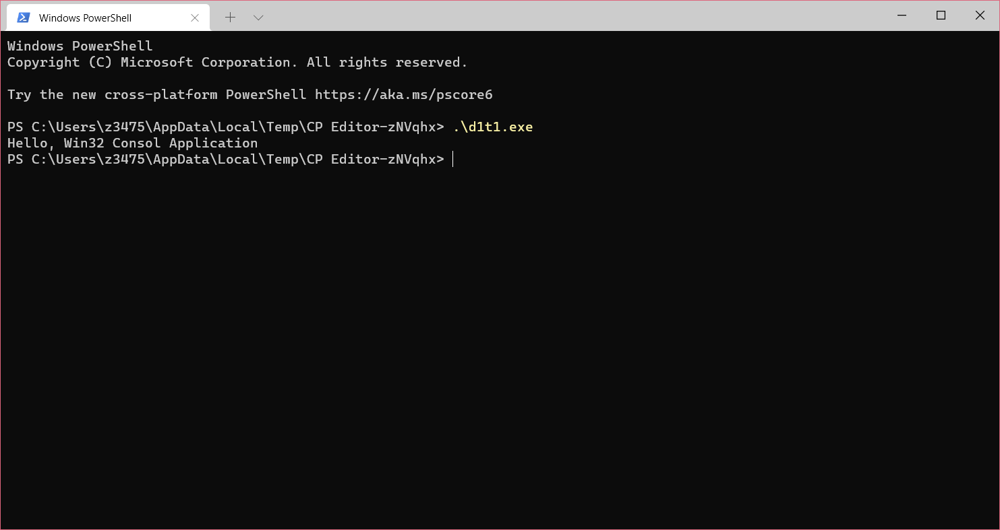
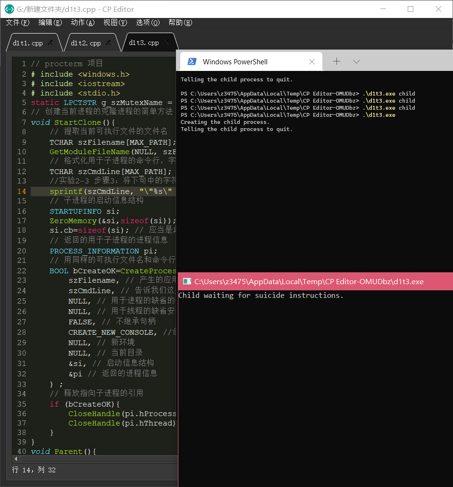

# 实验1-Windows进程管理

## 实验目的

- 学会使用VC编写基本的Win32 Console Application
- 通过创建进程、观察正在运行的进程和终止进程的程序设计和调试操作，进一步熟悉操作系统的进程概念，理解Windows进程的“一生”
- 通过阅读和分析试验程序，学习创建进程、观察进程、终止进程以及父子进程同步的基本程序设计方法

## 实验内容

### 子实验1-编写基本的Win32 Console Application

```cpp
#include <iostream>
int main()
{
	std::cout << "Hello, Win32 Consol Application" << std::endl;
}
```

### 子实验2-创建进程
  
```cpp
#include <windows.h>
#include <iostream>
#include <stdio.h>
// 创建传递过来的进程的克隆过程并赋于其ID 值
void StartClone(int nCloneID){
	// 提取用于当前可执行文件的文件名
	TCHAR szFilename[MAX_PATH];
	GetModuleFileName(NULL, szFilename, MAX_PATH);
	// 格式化用于子进程的命令行并通知其EXE 文件名和克隆ID
	TCHAR szCmdLine[MAX_PATH];
	sprintf(szCmdLine,"\"%s\" %d",szFilename,nCloneID);
	// 用于子进程的STARTUPINFO 结构
	STARTUPINFO si;
	ZeroMemory(&si,sizeof(si));
	si.cb=sizeof(si); // 必须是本结构的大小
	// 返回的用于子进程的进程信息
	PROCESS_INFORMATION pi;
	// 利用同样的可执行文件和命令行创建进程，并赋于其子进程的性质
	BOOL bCreateOK=::CreateProcess(
		szFilename, // 产生这个EXE 的应用程序的名称
		szCmdLine, // 告诉其行为像一个子进程的标志
		NULL, // 缺省的进程安全性
		NULL, // 缺省的线程安全性
		FALSE, // 不继承句柄
		CREATE_NEW_CONSOLE, // 使用新的控制台
		NULL, // 新的环境
		NULL, // 当前目录
		&si, // 启动信息
		&pi  // 返回的进程信息
	);
	// 对子进程释放引用
	if (bCreateOK){
		CloseHandle(pi.hProcess);
		CloseHandle(pi.hThread);
	}
}
int main(int argc,char* argv[]){
	// 确定派生出几个进程，及派生进程在进程列表中的位置
	int nClone=0;
	//修改语句：int nClone;
	//第一次修改：nClone=0;
	if (argc > 1){
		// 从第二个参数中提取克隆ID
		sscanf(argv[1] , "%d" , &nClone) ;
	}
	//第二次修改：nClone=0;
	// 显示进程位置
	std::cout << "Process ID:" << GetCurrentProcessId()
			<< ", Clone ID:" << nClone
			<< std :: endl;
	// 检查是否有创建子进程的需要
	const int c_nCloneMax=5;
	if (nClone < c_nCloneMax){
		// 发送新进程的命令行和克隆号
		StartClone(++nClone) ;
	} // 等待响应键盘输入结束进程
	getchar();
	return 0;
}
```

### 子实验3-父子进程的简单通信和终止进程

```cpp
// procterm 项目
# include <windows.h>
# include <iostream>
# include <stdio.h>
static LPCTSTR g_szMutexName = "w2kdg.ProcTerm.mutex.Suicide" ;
// 创建当前进程的克隆进程的简单方法
void StartClone(){
	// 提取当前可执行文件的文件名
	TCHAR szFilename[MAX_PATH];
	GetModuleFileName(NULL, szFilename, MAX_PATH);
	// 格式化用于子进程的命令行，字符串“child”将作为形参传递给子进程的main 函数
	TCHAR szCmdLine[MAX_PATH];
	//实验2-3 步骤3：将下句中的字符串child 改为别的字符串，重新编译执行，执行前请先保存已经完成的工作
	sprintf(szCmdLine, "\"%s\" child" , szFilename);
	// 子进程的启动信息结构
	STARTUPINFO si;
	ZeroMemory(&si,sizeof(si));
	si.cb=sizeof(si); // 应当是此结构的大小
	// 返回的用于子进程的进程信息
	PROCESS_INFORMATION pi;
	// 用同样的可执行文件名和命令行创建进程，并指明它是一个子进程
	BOOL bCreateOK=CreateProcess(
		szFilename, // 产生的应用程序的名称(本EXE 文件)
		szCmdLine, // 告诉我们这是一个子进程的标志
		NULL, // 用于进程的缺省的安全性
		NULL, // 用于线程的缺省安全性
		FALSE, // 不继承句柄
		CREATE_NEW_CONSOLE, //创建新窗口
		NULL, // 新环境
		NULL, // 当前目录
		&si, // 启动信息结构
		&pi // 返回的进程信息
	) ;
	// 释放指向子进程的引用
	if (bCreateOK){
		CloseHandle(pi.hProcess);
		CloseHandle(pi.hThread);
	}
}
void Parent(){
	// 创建“自杀”互斥程序体
	HANDLE hMutexSuicide=CreateMutex(
		NULL, // 缺省的安全性
		TRUE, // 最初拥有的
		g_szMutexName // 互斥体名称
	);
	if (hMutexSuicide != NULL){
		// 创建子进程
		std :: cout << "Creating the child process." << std :: endl;
		StartClone() ;
		// 指令子进程“杀”掉自身
		std :: cout << "Telling the child process to quit. "<< std :: endl;
		//等待父进程的键盘响应
		getchar() ;
		//释放互斥体的所有权，这个信号会发送给子进程的WaitForSingleObject 过程
		ReleaseMutex(hMutexSuicide) ;
		// 消除句柄
		CloseHandle(hMutexSuicide) ;
	}
}
void Child(){
	// 打开“自杀”互斥体
	HANDLE hMutexSuicide = OpenMutex(
	SYNCHRONIZE, // 打开用于同步
	FALSE, // 不需要向下传递
	g_szMutexName) ; // 名称
	if (hMutexSuicide != NULL){
	// 报告我们正在等待指令
		std::cout <<"Child waiting for suicide instructions. " << std::endl;
		//子进程进入阻塞状态，等待父进程通过互斥体发来的信号
		//WaitForSingleObject(hMutexSuicide, INFINITE);
		WaitForSingleObject(hMutexSuicide, 0);
		//实验2-3 步骤4：将上句改为WaitForSingleObject(hMutexSuicide, 0) ，重新编译执行
		// 准备好终止，清除句柄
		std::cout << "Child quiting." << std::endl;
		CloseHandle(hMutexSuicide);
	}
}
int main(int argc, char* argv[] ){
	// 决定其行为是父进程还是子进程
	if (argc>1&&strcmp(argv[1],"child")==0){
		Child() ;
	}else{
		Parent() ;
	} 
	return 0;
}
```

## 实验结果与分析

- 子实验1



- 子实验2

观察到不断有进程被创建，关掉最新创建的进程，进程创建被终止。

- 子实验3
  
  
  - 步骤1



执行./d1t3.exe

观察到一个子进程被创建，在父进程输入回车，子进程和父进程退出。

  - 步骤2

修改StartClone中命令行参数，观察到不断有子进程创建，关掉最新创建的进程，进程创建被终止。

  - 步骤3

修改子进程WaitForSingleObject第二个参数为0，观察到子进程马上退出。

## 小结与心得体会

windowsAPI命名风格为单词组合，单词首字母大写。

Windows进程间使用名字来区分互斥锁。

